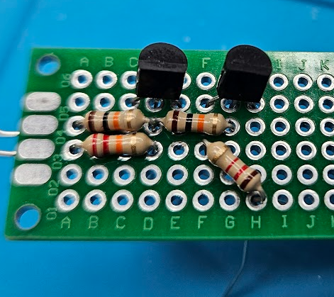
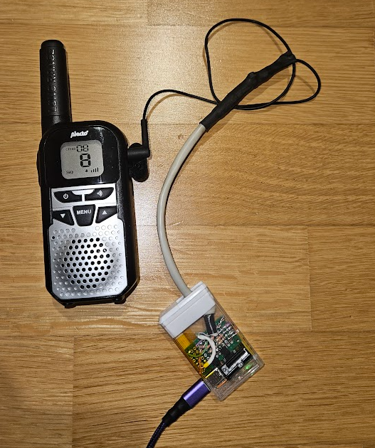

# Priprava vezja in vezava AIOC na PMR postajo

Na primeru "Alecto FR-66"

## 🔧 Izmerimo kaj se dogaja na priloženem zunanjem mikrofonu, ko stisnemo PTT

Multimeter pokaže 1,2 &Omega; med GND in MIC+ in to sporoči PMR postaji, da gre na oddajo (PTT).
Uporablja samo 3 povezave od 4ih na bananci zunanjega mikrofona postaje. To so: GND, MIC+, SOUND+. 

### 1.) Izmerimo kaj je na izhodih AIOC adapterja?

Na sliki sta še dva neoznačena konektorja, verjetno gre za stereo del zvoka.

### 2.) Ker rabimo 1,2 &Omega; upora na PMR na mikrofonskem vhodu je potrebno pripraviti inverzni signal

ChatGPT je pomagal pripraviti idejo, kako signal PTT iz AIOC obrniti, da bo na oddaji visok (3V) namesto trenutnega niskega signala na oddaji (0V)
Pripravljena shema z dvema tranzistorjema, da se obrne PTT signal:

Ideja, je da bi bila pozicija uporov tako, da je čim manj križanj:

3D prikaz:

3D prikaz, da se vidi kako so povezane žice, potrebno za naslednji korak:

### 4.) Pripravimo vezja:

Eksperimentiranje z različnimi upori:

Nato priprava končne verzije:

!

[alt text](../img/AIOC-PMR-shema9.png)

#### [Pojdi nazaj](RPi3-glavna-navodila.md)