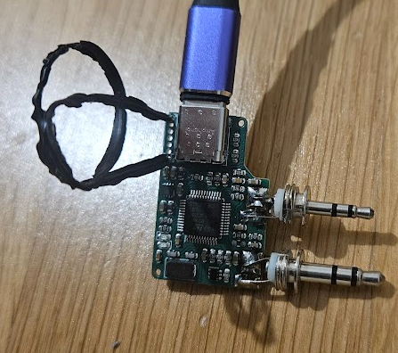

# Nadgradnja AIOC na firmware verzijo 1.3 RC1

(naprednejše nastavitve, če imate težave z VOX sprejemom in prekinjanjem pri pošiljanju v FRN omrežje)


[](https://www.youtube.com/watch?v=7LB6D2FLGZk&ab_channel=HamRadioDX)


## 🔧 Koraki za nadgradnjo AIOC modula na v 1.3 RC1*
<sup>\* [Navodilo za posodobitev na firmware verzije 1.3 RC2](#AIOC_1.3RC2)</sup>

### Potrebujete (to ali podobno):
 - RPi 3
 - prosto SD kartico
 - žičko
 - in seveda AIOC :)

### 1.) Poženemo Raspberry Pi Imager

https://www.raspberrypi.com/software/

### 2.) Izberemo "Raspberry Pi OS (Legacy, 32-bit)" ali "Raspberry Pi OS (other) → Raspberry Pi OS (Legacy, 32-bit) Lite

Izberemo **Bullseye** različico. Morda bi delovala tudi novejša različica, nisem preveril.

### 3.) Predeno zapišemo na kartico, izberemo "EDIT SETTINGS"

in nastavimo hostname, nastavimo uporabniško ime in geslo. Omogočimo  SSH (zavihek Services), nastavimo wifi, če ga bomo uporabljali.

### 4.) Zapišemo na SD kartico in jo vstavimo v RPi3

Priklopimo RPi3. Zgodi se generiranje SSH ključev in 2-3x reboot, konec je šele, ko pokaže IP in čaka na vpis gesla.

P.S.: wifi (wireless) je na začetku izklopljen, če ga ne potrebujemo niti ne bomo nastavili WLAN Country v raspi-config

### 5.) Namestitev potrebnih orodij pred nadgradnjo AIOC adapterja

```bash
sudo su -
```
Sama namestitev potrebnih orodij:
```bash
wget www.g1lro.uk/runmeonce.sh
chmod +x runmeonce.sh
./runmeonce.sh
```
Povežeš skrajna kontakta ob USB-C konektorju z žičko, da gre naprava v DFU način in priklopiš USB kabel



```bash
#PREBEREM trenutno naložen firmware:
dfu-util -a 0 -s 0x08000000 -U aioc-fw-pred-nadgradnjo.bin

#Zapišem firmware verzije 1.3
dfu-util -a 0 -s 0x08000000 -D aioc-fw-1.3.0-rc.1.bin

#Nastavimo, da postane naprava CM108:
python aioc.py
```
Preverimo:
```bash
lsusb
#Bus 001 Device 008: ID 1209:7388 Generic All-In-One-Cable
#...
```
USB kable na AIOC izklopimo in ponovno vklopimo in že imamo CM108 (C-Media Electronics)
```bash
lsusb
#Bus 001 Device 009: ID 0d8c:000c C-Media Electronics, Inc. Audio Adapter
#...
```

## 6.) 👁️ Ureditev pravic za dostop svxlinx uporabnika do /dev/hidraw0

Ob zagonu svxlink s pravicami svxlink uporabnika javi napako:<br>
*** <span style="color:orangered">ERROR</span>: <span style="color:gold">Could not open</span> event device /dev/hidraw0 specified in Rx1/HID_DEVICE: <span style="color:orangered">Permission denied</span>

```bash
#nano ali vi
#vstavite ukaz, ki pove, da bo imel svxlink uporabnik prvice nad AIOC hid napravo, za točno ta VID in PID naprave (CM108):

vi /etc/udev/rules.d/99-hidraw.rules
```
```bash
KERNEL=="hidraw*", SUBSYSTEM=="hidraw", MODE="0660", GROUP="plugdev"

#Ali če bi želeli dovolili uporabo samo točno določene naprave (ID 0d8c:000c)
#KERNEL=="hidraw*", SUBSYSTEM=="hidraw", ATTRS{idVendor}=="0d8c", ATTRS{idProduct}=="000c", MODE="0660", GROUP="plugdev"
```

### Uporabnika svxlink damo v plugdev skupino
```bash
sudo usermod -aG plugdev svxlink
```

### Ukazi, da začne udev ustrezno delovati

```bash
sudo udevadm control --reload-rules
sudo udevadm trigger
```
Pereverimo pravice
```bash
ls -l /dev/hidraw0
#crw-rw---- 1 root plugdev 244, 0 Dec 15 00:24 /dev/hidraw0
```

## Na koncu je potrebno popraviti svxlink.conf, da uporabimo /dev/hidraw0 napravo


```bash
#nano ali vi:
vi /etc/svxlink/svxlink.conf
```
[Datoteka svxlink.conf](../etc/svxlink/svxlink-HID.conf)
(datoteko bo potrebno preimenovati, če boste uporabili točno to datoteko)

<a name="Rx1"></a>

### *POZOR, to ni končna verzija .conf datoteke!*
```bash
###############################################################################
#                                                                             #
#                Configuration file for the SvxLink server                    #
#                                                                             #
###############################################################################

[GLOBAL]
#MODULE_PATH=/usr/lib/arm-linux-gnueabihf/svxlink
LOGICS=SimplexLogic
CFG_DIR=svxlink.d
TIMESTAMP_FORMAT="%c"
CARD_SAMPLE_RATE=48000
#mono:
CARD_CHANNELS=1
#LOCATION_INFO=LocationInfo
#LINKS=LinkToR4

[SimplexLogic]
TYPE=Simplex
RX=Rx1
TX=Tx1
#MODULES=ModuleHelp,ModuleParrot,ModuleFrn
MODULES=ModuleParrot,ModuleFrn
CALLSIGN=S5PMRKR0
SHORT_IDENT_INTERVAL=0
LONG_IDENT_INTERVAL=0
EVENT_HANDLER=/usr/share/svxlink/events.tcl
DEFAULT_LANG=en_US
#-1 da je RGR disabled:
RGR_SOUND_DELAY=-1
#REPORT_CTCSS=123.0
MACROS=Macros
FX_GAIN_NORMAL=0
FX_GAIN_LOW=-12

[Rx1]
TYPE=Local
AUDIO_DEV=alsa:plughw:2
AUDIO_CHANNEL=0
HID_DEVICE=/dev/hidraw0
HID_SQL_PIN=VOL_DN
SQL_DET=HIDRAW
SQL_HANGTIME=1500
DEEMPHASIS=0
#PEAK_METER=1
DTMF_DEC_TYPE=INTERNAL
DTMF_MUTING=1
DTMF_HANGTIME=40
DTMF_SERIAL=/dev/ttyS0
#PREAMP=3
PREAMP=2
#SQL_TAIL_ELIM=100

[Tx1]
TYPE=Local
AUDIO_DEV=alsa:plughw:2
AUDIO_CHANNEL=0
#LIMITER_THRESH=-6
PTT_TYPE=SerialPin
PTT_PORT=/dev/ttyACM0
PTT_PIN=DTR!RTS
#PTT_TYPE=Hidraw
#HID_DEVICE=/dev/hidraw0
#HID_PTT_PIN=GPIO3
TIMEOUT=300
#PREEMPHASIS=1
PREEMPHASIS=0
DTMF_TONE_LENGTH=100
DTMF_TONE_SPACING=50
DTMF_DIGIT_PWR=-15
#MASTER_GAIN=9
```
<br>

<a name="AIOC_1.3RC2"></a>
## Nadgradnja AIOC firmware na 1.3 RC2

Ker imate nameščena orodja za nadgradnjo (zgornja navodila)
in že znate dati AIOC v DFU načinu, potem pa:

```bash
wget https://github.com/skuep/AIOC/releases/download/v1.3.0-rc.2/aioc-fw-1.3.0-rc.2.bin

dfu-util -a 0 -s 0x08000000 -D aioc-fw-1.3.0-rc.1.bin

```
Datoteka **[aioc-1.3.0-RC.2.py](../AIOC/aioc-1.3.0-RC.2.py)**, da nastavimo VID in PID na CM108:

```bash
wget https://tomaz1.github.io/PMR-FRN-SvxLink/AIOC/aioc-1.3.0-RC.2.py
python aioc-1.3.0-RC.2.py
```

Če bo potreben revert iz RC.2 na original VID in PID, ali upgrade, moramo uporabiti ustrezen VID in PID, kot ga imamo nastavljenega na napravi, kot je [razloženo tu](../AIOC/www.g1lro.uk-v1.3-RC.1/aioc-revert.py).
```bash
aioc = hid.Device(vid=0x0d8c, pid=0x000c)
```

## Težave

 - Takoj po Tx (oddajanju) se sproži za cca 500ms Rx. Pri VOX proženju je možno nastaviti razne delaye in ni težav, pri HIDRAW pa tega ni.  
 Spodaj je razložena (začasna) rešitev, a bolje kot nič je, da imam dve Rx sekciji in "Voter":
 
 **POPRAVEK 27. 12. 24**: ko sem nastavil v Rx1 na SQL_HANGTIME=1500, ni bilo več zgornjih težav in Voter ni bil potreben. Bom zaenkrat vseeno pustil v novodilih, če bi slučajno kdo to potreoval zaradi kakršnegakoli razloga.
 
<sup>([Za Rx1 poglej zgoraj](#Rx1))</sup>

```bash
[SimplexLogic]
TYPE=Simplex
RX=Voter
...
[Rx1]
...
#Pri tej rešitvi je Rx2 lahko povsem enak kot Rx1
[Rx2]
...
[Voter]
TYPE=Voter
RECEIVERS=Rx1,Rx2
VOTING_DELAY=600
BUFFER_LENGTH=0
HYSTERESIS=50
```

## Viri

- [AIOC - github](https://github.com/skuep/AIOC)
- https://g1lro.uk/?p=676
- [Video how to upgrade](https://www.youtube.com/watch?v=7LB6D2FLGZk&ab_channel=HamRadioDX)
- [AIOC and SvxLink preko HIDRAW](https://github.com/skuep/AIOC/issues/86).


<hr>

#### [Pojdi nazaj](RPi3-glavna-navodila.md)