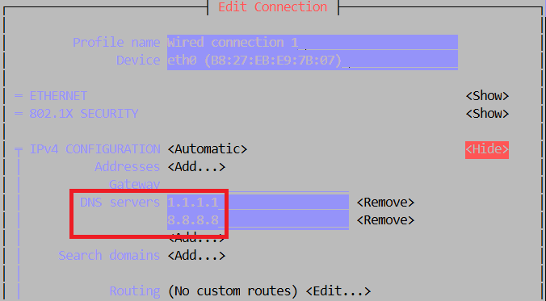

## Težave

- ### Ko vse pripravite in odnesete na drugo lokacijo, tunel ne deluje? Deluje vam ping v internet, RPi3 se poveže na FRN omrežje, zakaj ne na CloudFlare?

    Poskusite se povezati preko ukazne vrstice in dobite/vidite napako:

    ```bash
    /usr/bin/cloudflared --no-autoupdate tunnel run --token ey..(ključ)

    2024-12-15T15:58:05Z INF Starting tunnel tunnelID=5d4b4c8f...
    ...
    2024-12-15T15:58:06Z INF You requested 4 HA connections but I can give you at most 0.
    2024-12-15T15:58:06Z INF Tunnel server stopped
    2024-12-15T15:58:06Z ERR Initiating shutdown error="there are no free edge addresses left to resolve to"
    2024-12-15T15:58:06Z ERR icmp router terminated error="context canceled"
    2024-12-15T15:58:06Z INF Metrics server stopped
    ```
    Rešitev za zgornjo težavo je v DNS nastavitvah Rpi3:
    ```bash
    sudo nmtui
    ```
    S programom nmtui, če je potrebno, lahko nastavimo na statični IP.

    Vpišemo dva DNS strežnika:

    

    Preverimo:
    ```bash
    cat /etc/resolv.conf 
    # Generated by NetworkManager
    nameserver 1.1.1.1
    nameserver 8.8.8.8
    nameserver 192.168.0.1
    ```

<hr>

#### [Pojdi nazaj](CloudFlare.md)