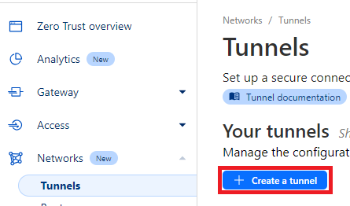
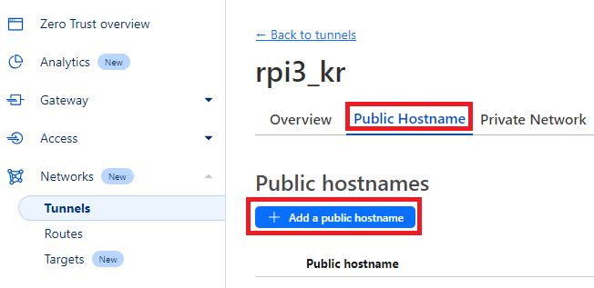
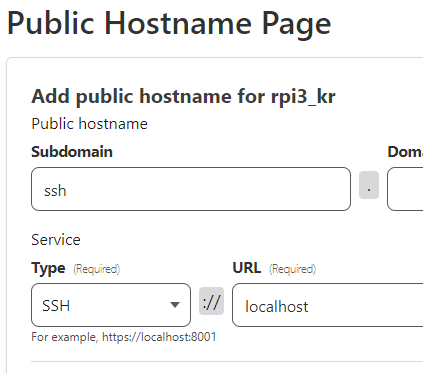
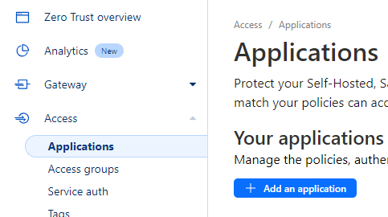
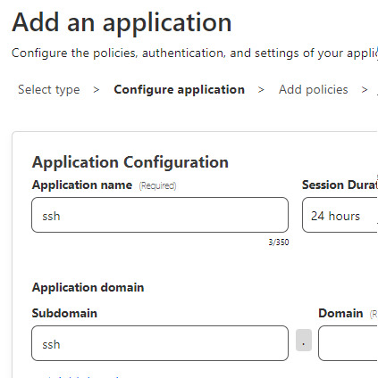
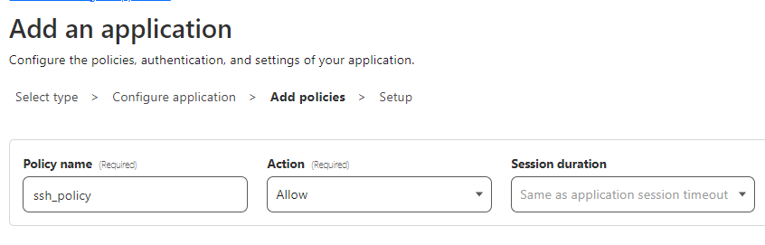
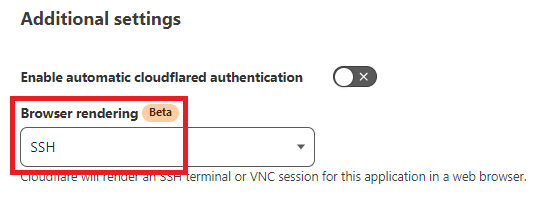
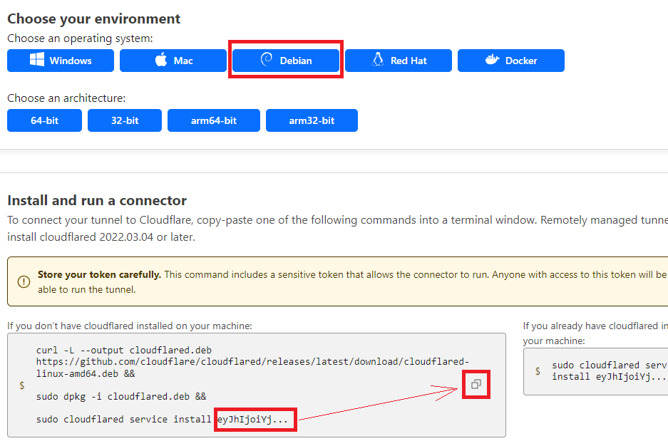
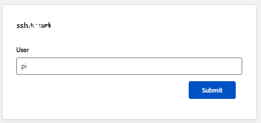
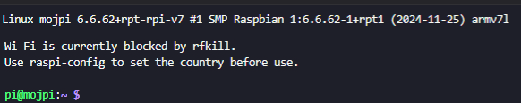

# CloudFlare SSH povezava preko brskalnika

(naprednejše nastavitve, niso obvezne za delovanje FRN prehoda)

Seveda obstajajo tudi drugi načini, npr. SSH preko Pi Connect Lite, VPNji itd...
Ker ravno uporabljam Cloudflare bom opisal ta način:

## 🛠️ Koraki za namestitev

### Predpogoj je, da imate cloudflare račun in vklopljen ZeroTrust na svoji domeni

[](https://www.youtube.com/watch?v=xRlM71fCdbY)

## 👁️ Priprava tunela za CF

### 1.) Ustvarimo tunel
V Zero Trust overview izberete Networks -> Tunnels -> Create a tunnel in ga poljubno poimenujemo :)



### 2.) Nastavimo Public Hostname

Na tunelu, ki smo ga ustvarili kliknemo na zavihek "Public Hostname" in nato Add a public hostname:



Nato vpišemo poljubno subdomain in v Service SSH in v polje URL vpišemo localhost:



### 3.) Nastavimo pravice za dostop
V Access -> Applications izberemo Add an application:



Nato izberemo Self-hosted in v oknu, ki se pokaže vpišemo in izberemo svojo domeno:



Nato kliknemo Next in vpišemo:



Nato kliknemo Next in gremo na dno strani, kjer pri Browser rendering izberemo SSH:



Nato končamo z gumbom "Add application"

### 4.) Namestitev cloudflare agenta

Ker na cloudflare ni povezave neposredno na paket za **armhf** arhitekturo, lahko pridobimo armhf.deb paket na istem github naslovu [github-cloudflare-releases](https://github.com/cloudflare/cloudflared/releases).

```bash
curl -L --output cloudflared.deb https://github.com/cloudflare/cloudflared/releases/latest/download/cloudflared-linux-armhf.deb && 

sudo dpkg -i cloudflared.deb && 

#ta ukaz tu ima na koncu ukaza "ključ", ki sem ga pobrisal. Vsaka namestitev ima svoj ključ in seveda boste vi dobili svoj ključ na cloudflare :)
sudo cloudflared service install eyJh... #(ključ)
```

Kluč z zgornjim ukazom za namestitev dobimo na cloudflare spletnem naslovu:

Po kliku na ikonico se v odlagališče skopirajo vsi ukazi. Uporabimo zadnjega, ker smo prve dva že pognali :smile:

### 5.) Preverimo delovanje:

https://ssh.nasadomena.si

In po 2FA CloudFlare prijavi se pokaže okno, kjer se lahko prijavimo na RPi3:



Po vpisu gesla, smo se uspešno logirali:



TODO: dodati navodilo, kako se prijavimo s certifikatom in kako ga pripravimo.

<br>

## Težave

- [Ko vse pripravite in odnesete na drugo lokacijo, tunel ne deluje? Deluje vam ping v internet, RPi3 se poveže na FRN omrežje, zakaj ne na CloudFlare?](CloudFlare-help.md) 

<hr>

#### [Pojdi nazaj](RPi3-glavna-navodila.md)