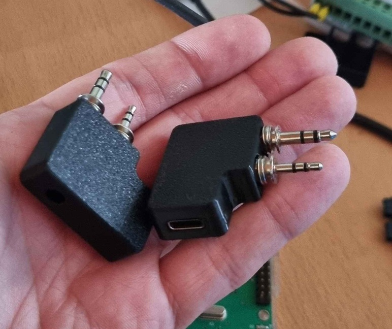
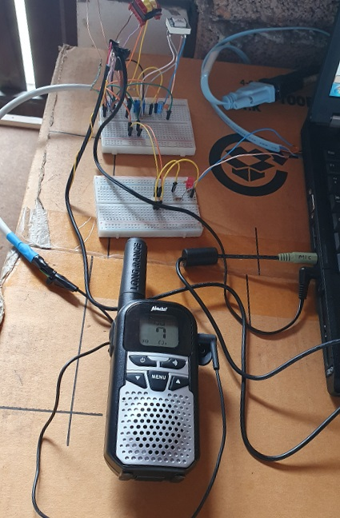
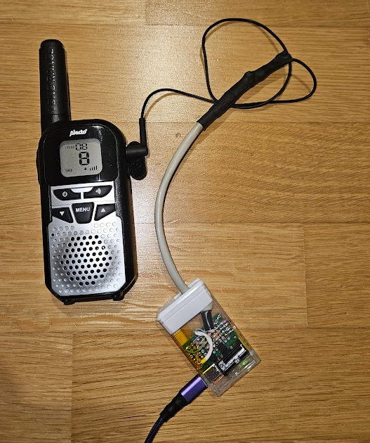

## 🧩 Predpogoji za postavitev SvxLinka

- Računalnik s povezavo v internet (npr Raspberry PI)

  

- vmesnik, da lahko povežeš željeno PMR postajo na ta računalnik (npr AIOC)

  

- PMR radijsko postajo
- Napajanje za računalnik in radijsko postajo

## 📷 Kako zgleda FRN prehod?
Primeri prehodov:

&nbsp;&nbsp;&nbsp;&nbsp;&nbsp;(TODO, dodati še kakšno slikico)

Moj prvi prehod na protobordu (2. 7. 2023) na JavaFRN Windows klientu:

&nbsp;&nbsp;&nbsp;&nbsp;&nbsp;

Slika postaje z AIOC adapterjem (in dodatnim mini vezjem, ker ta postaja nima standardnega vhoda, kot ostale postaje. Jan 2025):

[Pojdi nazaj](../README.md)
