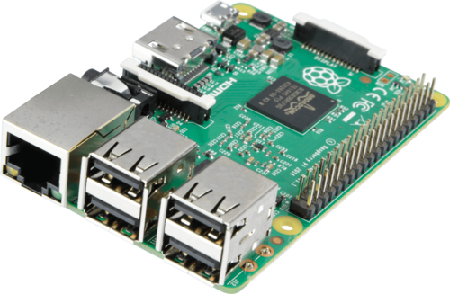
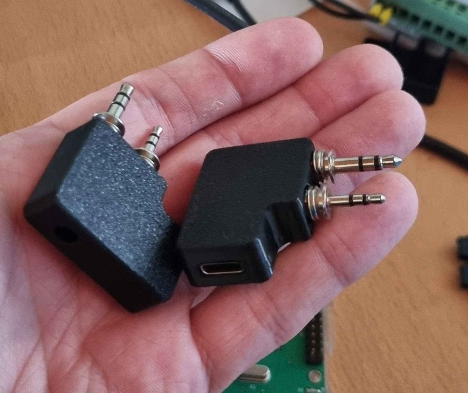
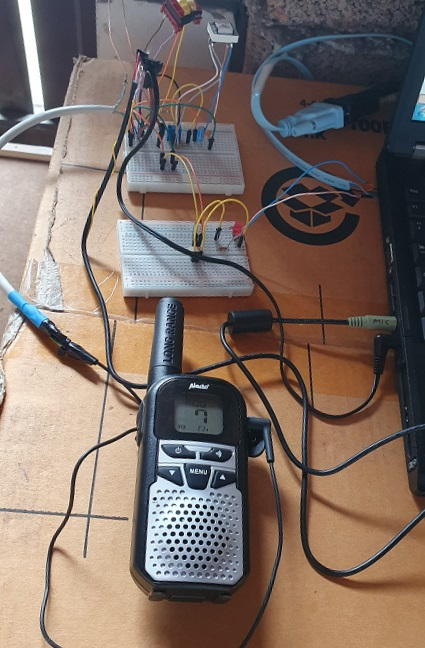
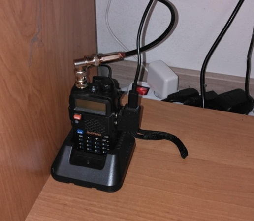
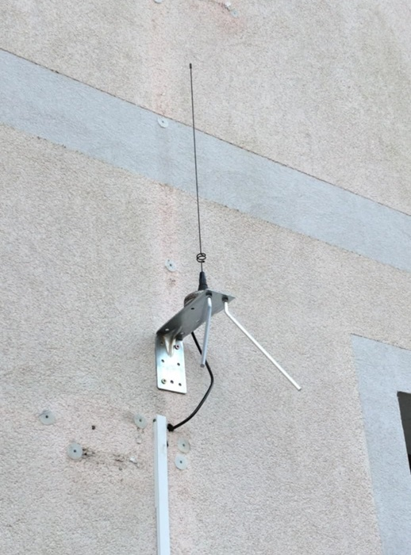
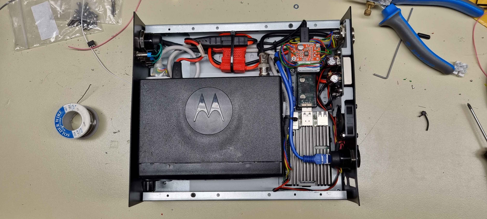
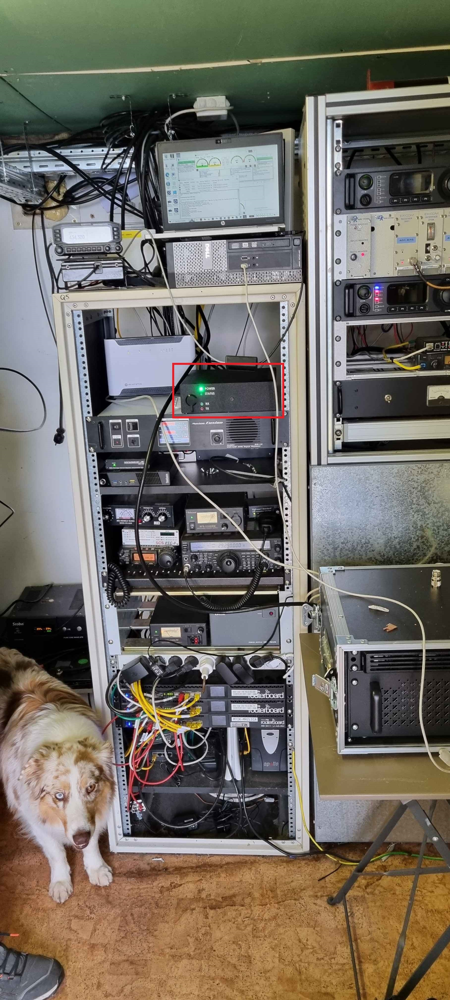

## 🧩 Predpogoji za postavitev SvxLinka

- Računalnik s povezavo v internet (npr Raspberry PI)
  
- vmesnik, da lahko povežeš željeno PMR postajo na ta računalnik (npr AIOC)
  
- Radijsko postajo z anteno
- Napajanje za računalnik in radijsko postajo

## 📷 Kako zgleda FRN prehod?
Primeri prehodov:

Ali moj prvi prehod na protobordu (2. 7. 2023) na JavaFRN Windows klientu:

Evgenov prehod:

Profesionalni FRN prehod:

[Pojdi nazaj](../README)
