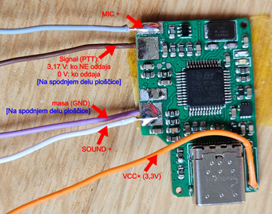

# 🛠️ Koraki za namestitev

Vir: <a href="https://tomaz1.github.io/PMR-FRN-SvxLink/" target="_blank">https://tomaz1.github.io/PMR-FRN-SvxLink/</a>

### 1.) Poženemo Raspberry Pi Imager

[https://www.raspberrypi.com/software/](https://www.raspberrypi.com/software/)

### 2.) Izberemo "Raspberry Pi OS (other)" → Raspberry Pi OS Lite (**32-bit**)

Izberemo "A port of Debian **Bookworm** with no desktop environment"

### 3.) Predeno zapišemo na kartico, izberemo "EDIT SETTINGS"

in nastavimo hostname, nastavimo uporabniško ime in geslo. Omogočimo  SSH (zavihek Services), nastavimo wifi, če ga bomo uporabljali.

### 4.) Zapišemo na SD kartico in jo vstavimo v RPi3

Priklopimo RPi3. Zgodi se generiranje SSH ključev in 2-3x reboot, konec je šele, ko pokaže IP in čaka na vpis gesla.

P.S.: wifi (wireless) je na začetku izklopljen, če ga ne potrebujemo niti ne bomo nastavili WLAN Country v raspi-config (točka v programu: *5. → L4*)

V nastavitve RPi3 pridemo z ukazom:

```bash
sudo su -

raspi-config
```

<sup>* "sudo su -" ukaz je zato, da ni potrebno pred ukaze vpisovati sudo. Tako postanemo root (uporabnik z največ pravicami)</sup>
<br>

### 5.) ⚒️ Nastavitve raspi-config:

#### "5 Localisation Options" → L1 Locale

→ sl_SI.UTF-8 UTF-8 <Ok> Default locale ostane na en_GB.UTF-8 <Ok>

#### "5 Localisation Options" → L2 Timezone

→ Europe <Ok> Ljubljana <Ok>

#### "5 Localisation Options" → L3 Keyboard

→ pustimo Generic 105-key PC <Ok> Slovenian - Slovenian (with guillemets) <Ok> Right Alt (AltGr) <Ok> No compose key <Ok>
Verjetno nepotrebno, ker se bomo oddaljeno prijavljali preko terminalske SSH seje.

#### "6 Advanced Options" → A1 Expand Filesystem

#### "8 Update"

ali ročno "apt update", "apt upgrade" nato po potrebi "y" (yes)
Obstaja tudi ukaz: "apt full-upgrade"

```bash
reboot
```

### 6.) Nastavitev statičnega IP-ja, če je potrebno

```bash
sudo nmtui 
```

in sledimo GUI vmesniku.

### 7.) Namestitev svxlink strežnika:

```bash
#apt update
sudo apt-get install svxlink-server
```

### 8.) ⚡Nastavitve SvxLink-a:

Poiščemo oz. preverimo ali je AIOC kartica zaznana

```bash
lsusb

#dobiti moramo
#Bus 001 Device 008: ID 1209:7388 Generic All-In-One-Cable
```

Poiščemo ali je zaznalo zvočno kartico na AIOC, [vir](http://np2wj.com/echolink-node-on-raspberry-pi-using-svxlink-part-1/):

```bash

arecord -l 
#prikaže:
#**** List of CAPTURE Hardware Devices ****
#card **2**: AllInOneCable [All-In-One-Cable], device 0: USB Audio [USB Audio]
#  Subdevices: 1/1
#  Subdevice #0: subdevice #0

aplay -l
#card 0: Headphones [bcm2835 Headphones], device 0: bcm2835 Headphones [bcm2835 Headphones]
#  Subdevices: 8/8
#  Subdevice #0: subdevice #0
#  Subdevice #1: subdevice #1
#  Subdevice #2: subdevice #2
#  Subdevice #3: subdevice #3
#  Subdevice #4: subdevice #4
#  Subdevice #5: subdevice #5
#  Subdevice #6: subdevice #6
#  Subdevice #7: subdevice #7
#card 1: vc4hdmi [vc4-hdmi], device 0: MAI PCM i2s-hifi-0 [MAI PCM i2s-hifi-0]
#  Subdevices: 1/1
#  Subdevice #0: subdevice #0
#card **2**: AllInOneCable [All-In-One-Cable], device 0: USB Audio [USB Audio]
#  Subdevices: 1/1
#  Subdevice #0: subdevice #0

sudo vi /usr/share/alsa/alsa.conf #ali nano /usr/share/alsa/alsa.conf
#in spremenimo v 2, ker je AIOC zaznana kot "card 2"
default.ctl.card 2 # iz 0
default.pcm.card 2 # iz 0

sudo reboot
```

Preverimo zvočno kartico

```bash
#nastavitve zvočne kartice:
alsamixer
#P.S. Tu zgoraj se tudi vidi številko USB AIOC zvočne kartice, če pritisnemo tipko F6.

#Takole se verjetno shrani nastavitve, nisem še preveril:
alsactl store
```

Kako ugotovimo serijski port za AIOC:

```bash
ls -l /dev/serial/by-id/
#total 0
#lrwxrwxrwx 1 root root 13 Dec  6 22:21 usb-AIOC_All-In-One-Cable_56a33314-if04 -> ../../ttyACM0
#in vidimo, da je **/dev/ttyACM0**
#ali 
dmesg | grep tty
#...
#[    8.087478] cdc_acm 1-1.5:1.4: ttyACM0: USB ACM device
#in isti rezultat ttyACM0
```

Vidimo, da je /dev/ttyACM0

#### Nastavitve svxlink.conf (**NI ŠE KONČNA VERZIJA; v delu**, tu Žigova datoteka 21. 2. 2025):

[Žigova svxlink.conf datoteka !](../etc/svxlink/svxlink.conf)


```bash
#naredimo varnostno kopijo
sudo cp /etc/svxlink/svxlink.conf /etc/svxlink/svxlink.bkp

#pridobimo Žigovo datoteko:
sudo wget https://tomaz1.github.io/PMR-FRN-SvxLink/etc/svxlink/svxlink.conf -O /etc/svxlink/svxlink.conf

#uporabimo vi ali nano, kar vam je bolj domače, da si pogledamo vsebino in po potrebi popravimo:
#sudo nano /etc/svxlink/svxlink.conf
sudo vi /etc/svxlink/svxlink.conf
```


#### Uredimo ModuleFrn.conf:

```bash
#naredimo varnostno kopijo nastavitev:
sudo cp /etc/svxlink/svxlink.d/ModuleFrn.conf /etc/svxlink/svxlink.d/ModuleFrn.bkp

#pridobimo datoteko:
sudo wget https://tomaz1.github.io/PMR-FRN-SvxLink/etc/svxlink/svxlink.d/ModuleFrn.conf -O /etc/svxlink/svxlink.d/ModuleFrn.conf

#uporabimo vi ali nano, kar vam je bolj domače, da si pogledamo vsebino in po potrebi popravimo:
#sudo nano /etc/svxlink/svxlink.d/ModuleFrn.conf
sudo vi /etc/svxlink/svxlink.d/ModuleFrn.conf

#vsebina datoteke:
[ModuleFrn]
NAME=Frn
PLUGIN_NAME=Frn
ID=2
#TIMEOUT=300

# Details http://freeradionetwork.eu/frnprotocol.htm

# main server
SERVER=pmr.si
PORT=10024

# backup server (Zaenkrat ga ni, zato nastavimo enako pmr.si)
SERVER_BACKUP=pmr.si
PORT_BACKUP=10024

# login details
VERSION=2014003
EMAIL_ADDRESS=emailnaslov@nekaj.nekaj
DYN_PASSWORD=GESLO
CLIENT_TYPE=1
CALLSIGN_AND_USER="S5PMRxxx, Ime"
BAND_AND_CHANNEL="446.xxxxxFM CTCSS 123.0Hz"
DESCRIPTION="CH1x(SUB18), SvxLink, RPi3, AIOC"
COUNTRY=Slovenia
CITY_CITY_PART="Kraj - Predel kraja"
NET=Test

# debugging
#FRN_DEBUG=1
#DISABLE_RF=1
```

#### Namestitev zvočnih datotek za SvxLink:

Pri trenutni postavitvi piše, da gre za svxlink v1.7.0 in zgleda je to verzija 19.09, [vir](https://github.com/sm0svx/svxlink/blob/maint/src/doc/README-19.09.adoc)<br>
Kako se namesti datoteke, [vir](https://it9fdp.blogspot.com/2015/09/installare-svxlink.html):

```bash
sudo su -
cd /usr/share/svxlink/sounds/
wget https://github.com/sm0svx/svxlink-sounds-en_US-heather/releases/download/19.09/svxlink-sounds-en_US-heather-16k-19.09.tar.bz2
bunzip2 svxlink-sounds-en_US-heather-16k-19.09.tar.bz2
tar -xvf svxlink-sounds-en_US-heather-16k-19.09.tar
cp -r en_US-heather-16k en_US
rm svxlink-sounds-en_US-heather-16k-19.09.tar
rm -r ./en_US-heather-16k/
```


#### Uredimo logiko, da se avtomatsko požene FRN modul:
Gre za spremenjeno Tilnovo SimplexLogic.tcl datoteko!

TODO zame, 15. 1. 25, https://github.com/sm0svx/svxlink/wiki/Events-Handling-System Naj se ne bi popravljalo direktno .tcl datotek, vendar dodalo mapo local in tja skopiralo datoteke .tcl in se jih naj bi urejalo tam!

[Datoteka SimplexLogic.tcl](../usr/share/svxlink/events.d/SimplexLogic.tcl)

```bash
#naredimo varnostno kopijo
sudo cp /usr/share/svxlink/events.d/SimplexLogic.tcl /usr/share/svxlink/events.d/SimplexLogic.bkp

#pridobimo Žigovo datoteko:
sudo wget https://tomaz1.github.io/PMR-FRN-SvxLink/usr/share/svxlink/events.d/SimplexLogic.tcl -O /usr/share/svxlink/events.d/SimplexLogic.tcl

#uporabimo vi ali nano, kar vam je bolj domače, da si pogledamo vsebino in po potrebi popravimo:
#sudo nano /usr/share/svxlink/events.d/SimplexLogic.tcl
sudo vi /usr/share/svxlink/events.d/SimplexLogic.tcl
```

#### Da ob zagonu FRN modula tega ne govori v eter/internet:

```bash
#uporabimo vi ali nano, kar vam je bolj domače, da si pogledamo vsebino in po potrebi popravimo:
#sudo nano /usr/share/svxlink/events.d/Module.tcl
sudo vi /usr/share/svxlink/events.d/Module.tcl

#zakomentiramo activating/deactivating modula

proc activating_module {module_name} {
  #playMsg "Default" "activating";
  #playSilence 100;
  #playMsg $module_name "name";
  #playSilence 200;
}

#
# Executed when a module is being deactivated.
#
proc deactivating_module {module_name} {
  #playMsg "Default" "deactivating";
  #playSilence 100;
  #playMsg $module_name "name";
  #playSilence 200;
}
```

#### Nastavimo, da se svxlink vedno zažene bo zagonu:

```bash
#test delovanja
sudo -u svxlink svxlink

#da se zažene avtomatsko po rebootu/zagonu
sudo svxlink --daemon

#kontrola servica:
sudo systemctl status svxlink

#Če želimo ustaviti servis, da bomo potestirali delovanje z različnimi nastavitvami to naredimo tako:
sudo systemctl stop svxlink
sudo -u svxlink svxlink
    #da zapremo / končamo testiranje pritisnemo tipke: CTRL+C

#Ko smo zadovoljni z rezultatom lahko ponovno poženemo SvxLink, da teče kot servis v ozadju
sudo systemctl start svxlink

```

#### Logi SvxLink:

```bash
#spremljanje loga v živo:
tail -f /var/log/svxlink
```
### 9.) Skripta za healthcheck (Avtor: Žiga, 12/24, hvala)

```bash
#Avtomatska namestitev, kar je pripravil Žiga.
sudo wget https://tomaz1.github.io/PMR-FRN-SvxLink/install/install_svxlink_healthcheck.sh
sudo chmod +x install_svxlink_healthcheck.sh

./install_svxlink_healthcheck.sh

#preverimo delovanje
sudo systemctl stop svxlink
#počakamo in vidimo, če se bo svxlink sam pognal?
#lahko spremljamo log:
tail -f /var/log/svxlink_healthcheck.log
```

V kolikor bi želeli, da svxlink namenoma res ostane izklopljen:
```bash
sudo systemctl stop svxlink_healthcheck
sudo systemctl stop svxlink
```

Ali [namestite ročno](svxlink_healthcheck.md) (po Žigovih navodilih).


### 10.) Nastavitev oddaljenega SSH dostopa preko brskalnika (brez odpiranja portov)

Oddaljen SSH dostop je možen na več načinov, navodila za dostop z uporabo:
  - [storitve CloudFlare Zero Trust](CloudFlare.md)
  - [VPN WireGuard](VPN-WireGuard.md)
  - [storitve Raspberry Pi Connect (TODO)](RPi-Connect.md)
  

### 11.) Če imate težave z VOX sprejemanjem?

Če vas radijska postaja sprejema in pošilja v FRN omrežje, vendar se dogaja, da če ste (pre)tiho VOX ne zazna govora in prekine pošiljanje v FRN omrežje? 

[Nadgradnja AIOC na firmware 1.3 in uporaba proženja preko HIDRAW namesto preko serijskega porta (Navodilo, povezava na navodila).](AIOC-upgrade-FW-to-1.3.md)

### 12.) Kaj če ima PMR postaja samo eno bananco za vhod in drugače obravnava mikrofonski vhod?

Ali lahko še vedno uporabimo AIOC adapter? Prva verzija navodil:  [Priprava vezja in vezava](AIOC-PMR-extra.md)

### 13.) ⛓️ AIOC pini, če bi kdo potreboval

Shema ni 100% pravilna, ampak za začetek nekaj je:



### 14.) 🔌/🔋 Napajanje
(TODO)

### Pomoč / Viri
- **[PMR Slovenija - spletna stran https://pmr.si](https://pmr.si)**
- [Navodila za namesitev FRN prehoda na sistemu Java FRN](https://slo-tech.com/forum/t834577/p8355681?fbclid=IwZXh0bgNhZW0CMTAAAR3apADiQJbOcgX9zCMiAXMCZ_xrUPe8YrlSoydmHYD4oyywWxe3iKNXdxw_aem_7KIs547M3SwynhY7aNpZ_Q#p8355681) (Slo-Tech forum)
- [Github SvxLink](https://github.com/sm0svx/svxlink)
- [SvxLink Discussions](https://groups.io/g/svxlink)
- [AIOC adapter](https://github.com/skuep/AIOC)


### Zahvale
@Žiga<br>
@Tilen<br>
@Franc (Radovljica)<br>
@Evgen (spletna stran <a href="https://pmr.si">pmr.si</a>)<br>
... **TODO - Dodati še vse ostale**

<hr>
Datum: 02/2025 

[@Tomaz1](https://github.com/tomaz1) - priprava navodil.

<hr>

#### [Pojdi nazaj](../README.md)