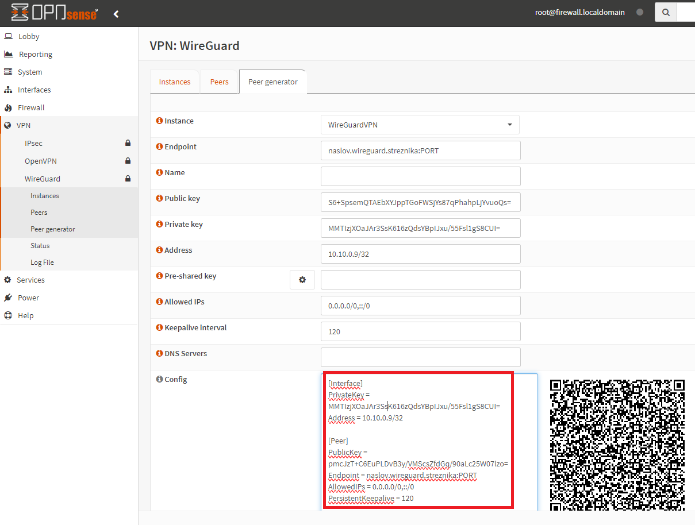

# VPN WireGuard

Predpogoj: že postavljen WireGuard strežnik :)

## 🛠️ Namestitev

```bash
sudo apt install wireguard

```
### Priprava konfiguracijska datoteke

Primer generiranja ključev na OpnSense, vsebino polja Config skopiramo v /etc/wireguard/wg0.conf:


```
#sudo vi ali sudo nano /etc/wireguard/wg0.conf
sudo vi /etc/wireguard/wg0.conf

#vsebina je kar ste dobili v polju Config na OpnSense strežniku:
[Interface]
PrivateKey = .....=
Address = 10.10.0.8/32
#DNS = 8.8.8.8

[Peer]
PublicKey = .....=
Endpoint = naslov.wireguard.streznika:port
#Če želimo, da gre ves promet (tudi FRN) v VPN tunel:
AllowedIPs = 0.0.0.0/0,::/0
#Če ne želite, da gre ves promet v VPN lahko nastvite samo IP-je
#oz. segmente omrežij, katerih promet bo šel skozi WireGuard VPN tunel:
#AllowedIPs = 192.168.1.0/24,10.10.0.0/24
PersistentKeepalive = 120
```

```bash
sudo wg-quick up wg0
#preverite ali vam VPN povezava deluje

#ustavite povezavo
sudo wg-quick down wg0

#poženemo kot service
sudo systemctl start wg-quick@wg0

#nastavimo, da se service požene ob zagonu sistema
sudo systemctl enable wg-quick@wg0
#Created symlink /etc/systemd/system/multi-user.target.wants/wg-quick@wg0.service → /lib/systemd/system/wg-quick@.service.

#preverimo status:
sudo systemctl status wg-quick@wg0

# v primeru težav lahko pogledamo loge z ukazom:
journalctl -u wg-quick@wg0
```

## Viri:
- [Namestitev WireGuard klienta](https://upcloud.com/resources/tutorials/get-started-wireguard-vpn)
- [Namestitev WireGuard klienta na Rpi](https://wireguard.how/client/raspberry-pi-os/)
- [Postavitev WireGuard strežnika na OpnSense](https://www.zenarmor.com/docs/network-security-tutorials/how-to-setup-wireguard-on-opnsense)

<hr>

#### [Pojdi nazaj](RPi3-glavna-navodila.md)